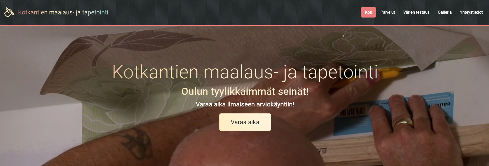

# Kotkantien maalaus- ja tapetointi

Welcome to the repository for **Kotkantien maalaus- ja tapetointi**, a professional painting and wallpapering service based in Oulu. This project showcases a modern website designed to present the company's services, gallery, and contact details to potential customers.

[Link to the website](https://geronimo.okol.org/~junmar/kmjt/)

---

## Table of Contents
- [About](#about)
- [Images](#images)
- [Technologies Used](#technologies-used)
- [Installation](#installation)

---

## About

The website is designed to be user-friendly and responsive, offering:
- Information about the company's services.
- A FAQ section to answer common customer inquiries.
- Customer reviews showcasing the satisfaction of past clients.
- A color testing tool allowing customers to preview wall colors.
- A gallery displaying available custom wallpaper designs.
- Contact options for inquiries or service requests.

---

## Images

| Page                                      | Screenshot                                |
|-------------------------------------------|-------------------------------------------|
| **index.html<br>(Header)**                |  |
| **services.html<br>(Offered services)**   |  |
| **colortext.html<br>(Color testing tool)**|  |
| **gallery.html<br>(Showcased wallpapers)**|  |
| **contact.html<br>(Contact form)**        |  |

---

The original font sizes were designed as follows: 20–24 pixels for headings (h1), 14–16 pixels for subheadings (h2), and 12 pixels for body text. I persuaded the customers to adopt larger font sizes for improved readability and aesthetics.

| Original font sizes                        | Updated font sizes                        |
|--------------------------------------------|-------------------------------------------|
|  | |

---

## Technologies Used

- HTML5
- CSS3
- Bootstrap 5
- JavaScript (ES6+)
- jQuery (3.7.1)

---

## Installation

To run this project locally:

1. Clone the repository:
   ```
   git clone https://github.com/yourusername/kmjt.git
   ```
2. Navigate to the project folder:
   ```
   cd kmjt
   ```
3. Open the index.html file in your browser.
